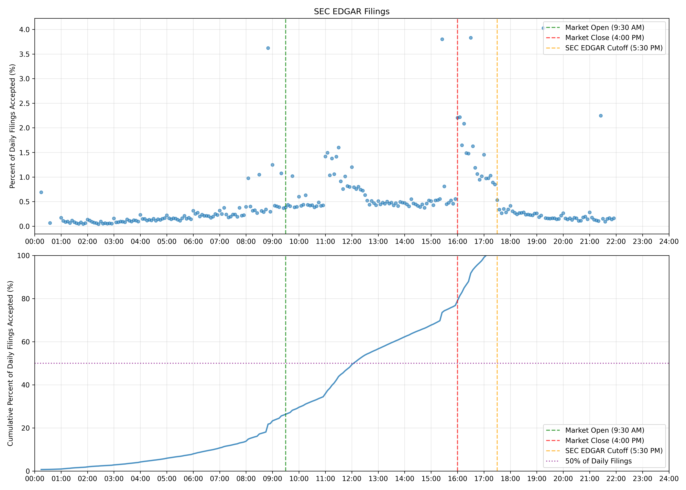
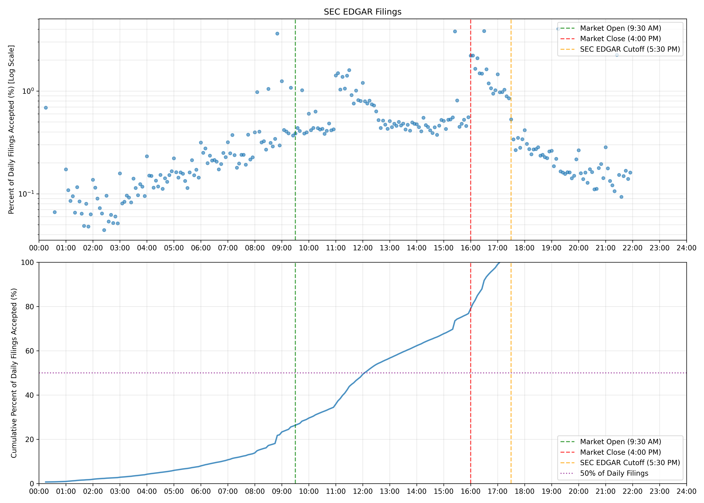
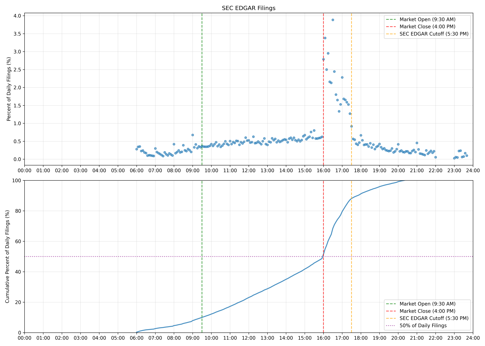
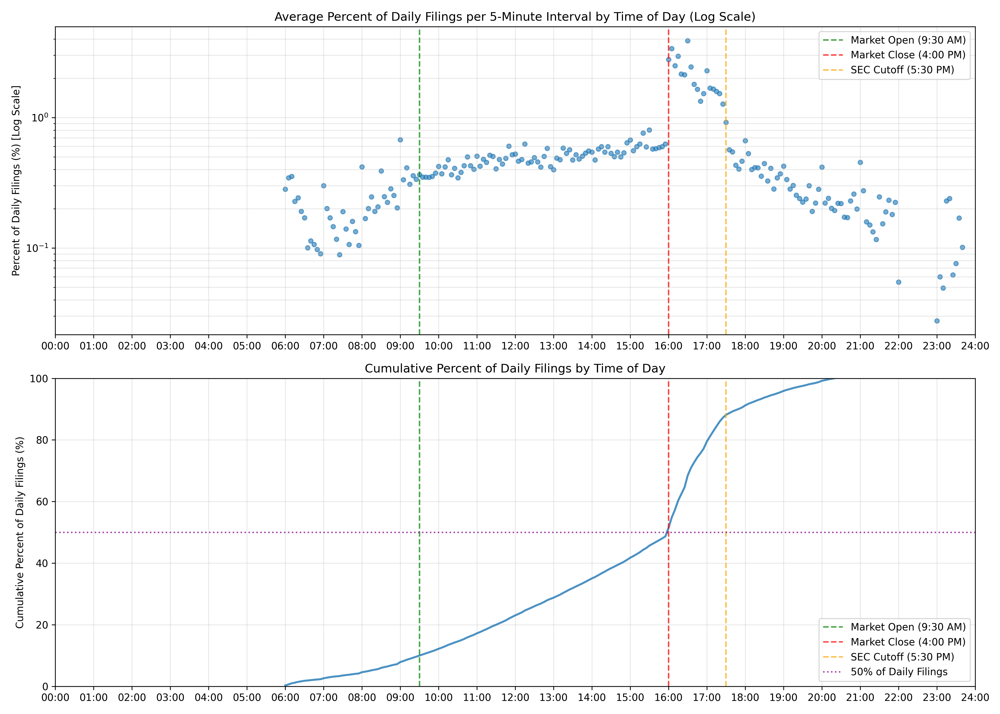
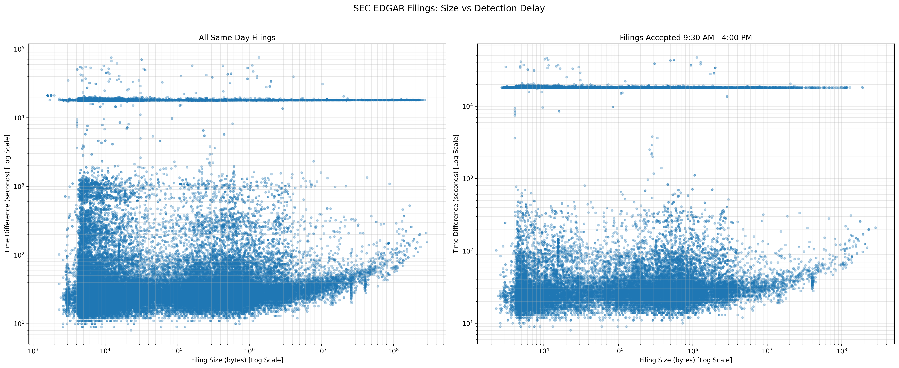
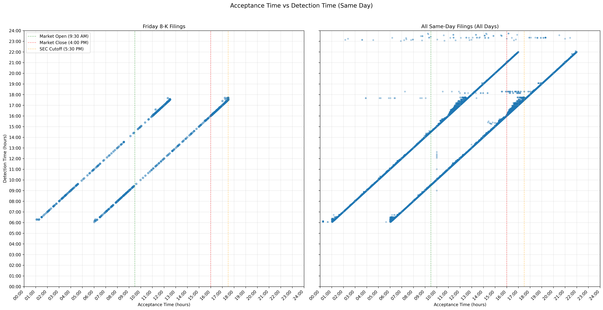

# Reverse Engineering How the SEC's EDGAR Works

## How a filing becomes public

When a filing is accepted by EDGAR, a sec.gov [index page](https://www.sec.gov/Archives/edgar/data/114036125029921/0001140361-25-029921-index.html) is created. This page contains links to the filing and its attachments, but they don't work yet.

The SEC then uploads the filing and attachments to where those links points. The links now work.

Then, the SEC notifies via RSS or other methods, that the filing has been released. This can be 30s+ after a filing is made public, so traders can expoit this. See [The fastest way to get SEC filings](https://github.com/john-friedman/The-fastest-way-to-get-SEC-filings). 

The time it takes for the SEC to upload filings to where the links point depends on the composition of the filing. For example, larger filings take longer to propagate.

The graph is a bit messy. Partly due to a small sample size, partly because I do not track whether a filing is released vs rss or efts on my free [websocket](https://john-friedman.github.io/datamule-python/datamule-python/portfolio/portfolio/#stream_submissions).

> Note: RSS is the commonly used way to get notifications of new filings. But some filings are missed by RSS, and so are first noticed via the EFTS method. I suspect filing composition plays a role here, but I can't verify, as I stupidly have not been recording which method detects the filing first. I plan to derive this later.

## What I think is going on under the hood

Filing comes in -> sent to validation process -> bad -> returns to user
Filing comes in -> sent to validation process -> good -> proceeds to pipeline that uploads data to the SEC's website.

Upload pipelines:
1. Creates index page - typically created and made public at same time as filing's metadata AcceptanceDatetime.
2. Uploads files - can take hours.

Index page creation is easy. Requires a scan of the filing upload in SGML form, and extraction of metadata tags.

Upload file creation involves parsing the SGML file, decoding uuencoded files, etc, that done badly can load a lot of data into memory. Here is an efficient [SEC SGML](https://github.com/john-friedman/secsgml) parser.

Validated filing pipelines:

- Validated Filing comes in after market hours -> sent to sent to batch process 1 -> processed next day starting at 6am -> uploaded -> rss updated
- Validated Filing comes in during market hours -> instance for instant processing -> succeeds -> uploads -> rss updated
- if fails -> sent to batch process 2 -> uploaded -> rss not notified -> becomes accessible on efts

Good chance of many more pipelines depending on form type.

I think instant upload pipeline failing either is due to:

1. temporarily out of capacity
2. filing triggers an error, such as out of memory.

## What detected means

When [datamule](https://datamule.xyz/) detects a new filing via rss or efts.

## Important Times (Eastern)

- 6:00am: SEC begins accepting filings
- 9:30am: Markets open
- 4:00pm: Markets close
- 5:30pm: SEC stops accepting filings for same day filing
- 10:00pm: SEC stops accepting files

## Plotting filing AcceptanceDatetime metadata
When a filing is accepted by EDGAR.

Note the absence of filings between 10:00pm and 12:00am.

## Plotting when filings are detected

Note that half of filings are detected after hours.

**Log Scale**

## AWS Log Spot Checks
- In my AWS Cloudwatch logs from 6:00am to 9:30am Eastern, efts records many more new filings than rss.
- EFTS logs begin at 6:00am Eastern and typically end within a few minutes.
- RSS logs begin at 6:00am Eastern and slowly ramp up in frequency.

Logs are available on request to researchers.

## Plotting size of filing and time to propagate

See that line around 3 hours?

## Why does a file go to the delayed cycle

While working on procesing all EDGAR images, PIL, python's image library began warning me of possible DOS attacks.

Some of the images looked funny. That they might expand on parsing, e.g compression bombs!

I don't think this is evidence of malfeasance, but it made me realize that EDGAR is probably very easy to overload.

So, how would this happen?

Well, EDGAR takes in ASCII files. Files that are not ASCII, e.g. images,pdf, etc are uuencoded.

To trigger an error in the public upload pipeline, but allow the validation process to still work, an out of memory error is most likely.

When parsing the filing for upload, the parser needs to decode the uuencoded data, split files, etc, which can be memory intensive, if not utilizing streaming to disk.

So images that expand on load, pdfs, zips, etc, could trigger OOMs.

## Could a bad actor trigger this on purpose?

Yes. A company or entity could trigger this.

I don't have a good motive for why someone would do this. Typically, filings are released via newswire or available on a company's investor relations page beforehand.

Brad Hughes' [article](https://news.disclosable.ca/p/friday-night-filings-fbi-raids-and?r=6mu3ux&utm_campaign=post&utm_medium=web&triedRedirect=true) provides a potential motive. Companies are known to release 8-K (current report) filings with negative information on Friday after market closes so as to bury the information.

So, a motivated actor could...file before 5:30pm, trigger an OOM, and get the SEC data to release several hours later. 

## Has someone done this?
I don't have the data. I only started tracking the SEC in late 2025.

## Friday Night Dump

## Do I misunderstand how EDGAR works?

Yes. Please email me corrections at johnfriedman@datamule.xyz.

## Data

Preliminary work was done using the public dump of datamule's detected time dataset on [Github](https://github.com/john-friedman/datamule-data/blob/master/data/datasets/detected_time_2025_12_03.csv.gz) 

Up to date work was done using datamule's [APIs](https://john-friedman.github.io/datamule-python/datamule-python/sheet/sheet/).

Datasets include all filings recorded in the [SEC's master index](https://www.sec.gov/Archives/edgar/daily-index/bulkdata/submissions.zip). This is a broad definition of filing that may differ from yours. I've made it easy to download [here](https://john-friedman.github.io/datamule-python/datamule-python/utils/convenience/#construct_submissions_data).